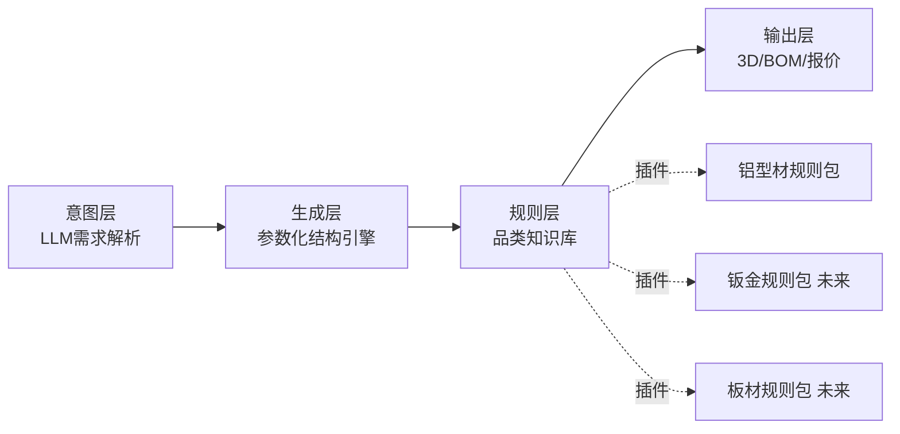

# 随构 · 产品方案 PRD

## 1. 产品定义

**产品名**（暂定）：随构
**一句话**：意图驱动的参数化制造平台——用户描述需求，系统输出可下单生产的完整方案（结构 + 选型 + 连接 + 加工 + BOM + 价格）。

## 2. 目标用户（按优先级）

| 优先级 | 用户 | 痛点 | 阶段 |
|---|---|---|---|
| P0 | 非机械专业的工程师/创客 | 懂需求不懂型材细节（连接件/公差/欧标国标），有付费能力 | Phase 1 切入 |
| P1 | DIY个人用户 | 完全不懂制造，需求简单（收纳架/桌面架/宠物笼） | Phase 2 |
| P2 | 小型设备厂/集成商 | 要BOM、图纸、批量询价、对公流程 | Phase 2-3 |

> [!warning] 决策记录
> 用户曾表态"全都要"。共识：终局全都要，但切入必须单点。第一批用户锁定 P0。

## 3. 核心用户旅程（目标态）

1. 用户输入："我要一个1.2m宽、0.6m深、0.75m高的工作台，台面承重50kg，黑色，桌面用木板"
2. 系统解析意图 → 结构参数（LLM只做参数抽取，不算几何）
3. 参数化引擎生成框架结构（确定性代码）
4. 规则层校验与决策：型材系列选择、连接方式决策、加工孔位自动生成、承重估算
5. 输出：3D预览 + 切割清单 + 连接件BOM + 加工清单 + 参考价格
6. 用户微调（改尺寸/换颜色/换连接方式）→ 重新生成
7. 确认 → 下单（Phase 1 人工代购履约，Phase 2 自动化）
> [!important] 2026-08-04 战略修正
> 本旅程按"AI驱动精细化六环节"重写基调（见 [[00-随构-项目总览]]）：意图理解=工程师式对话（追问优先级：安全→成本→外观）；输出=方案空间（2-3个带取舍解释的方案+结构计算书）而非单一方案；安装步骤图/爆炸图为生成副产品随单交付。

## 4. 功能清单（按阶段）

### Phase 0 — 技术验证 Demo
- [ ] 自然语言输入框（单场景：正交框架/工作台/置物架）
- [ ] LLM 参数抽取（结构化输出：外形尺寸/承重/材质偏好/颜色/场景）
- [ ] 参数化框架生成引擎（确定性）
- [ ] 型材选型规则（知识库驱动）
- [ ] 连接方式决策树（角码/内置/锚式/口哨 → 附带加工孔位）
- [ ] Three.js 3D 预览
- [ ] 切割清单 + BOM + 参考价格输出
- 不做：登录、支付、订单、自由设计器、移动端

### Phase 1 — MVP
- [ ] 用户系统、方案保存/历史
- [ ] 参数微调界面（表单式，非自由拖拽）
- [ ] 人工履约流程（后台接单 → 代下单 → 物流跟踪录入）
- [ ] 简单支付（方案费或整单差价模式）
- [ ] 需求→方案的转化率/客单价埋点

### Phase 2 — 平台化
- [ ] 供应链对接（型材商/加工厂）
- [ ] 自动报价引擎
- [ ] 结构/承重校验（差异化壁垒，嘉立创没有）
- [ ] 订单系统、售后流程
- [ ] B端：BOM导出、图纸导出（DXF/STEP）

### Phase 3 — 生态与扩品类
- [ ] 方案模板市场 + 创作者分成
- [ ] 品类插件框架（钣金/板材家具/管材）
- [ ] 开放API

## 5. 核心架构原则

1. **品类知识必须是数据/配置，不能硬编码进引擎**（嘉立创的死穴就是规则与平台耦合）
2. **LLM 不算几何**：只做意图→参数的转换；几何由确定性代码生成；规则校验兜底。杜绝幻觉尺寸
3. **每一层可独立替换**：换LLM、换渲染器、换品类包都不动其他层

## 6. 商业模式假设（待验证）

| 模式 | 阶段 | 说明 |
|---|---|---|
| 方案服务费 | Phase 1 | 生成方案免费，导出完整图纸/BOM收费 |
| 代购差价 | Phase 1 | BOM人工代下单，赚采购差价 |
| 交易抽成/加工毛利 | Phase 2 | 打通供应链后 |
| 模板分成/会员 | Phase 3 | 生态期 |

## 7. 风险与应对

| 风险 | 应对 |
|---|---|
| AI方案不可靠（错误连接/幻觉尺寸） | LLM只抽参数；几何确定性生成；规则校验+承重估算兜底；不确定时降级问用户 |
| 嘉立创跟进AI | 窗口期12-24个月；做深垂直体验和知识库质量 |
| 供应链无毛利 | Phase 1 人工履约先验证需求，不提前投入 |
| 业余时间做不完 | Phase 0 锁死单场景；准备工作全部完成后才开工（见 [[04-开发前准备工作清单]]） |
| 需求是伪需求 | Phase 0 前先做用户访谈（见准备清单），收集≥30条真实"一句话需求" |

## 8. 成功指标

- Phase 0：10条真实需求，≥8条生成"行家认可"的方案
- Phase 1：需求→下单转化率 ≥5%；30天复购/二次生成 ≥20%
- Phase 2：单均毛利为正；自动报价覆盖率 ≥90% 订单
