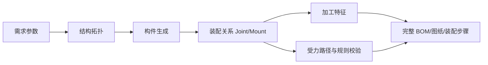
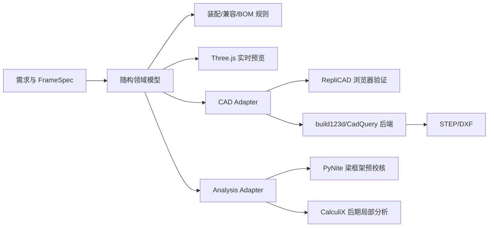

---
tags:
  - 随构
  - 产品评测
  - 用户体验
  - 结构能力
  - Phase0
created: 2026-08-05
status: 已消化归档——P0/P1/装配层/意图层/三栏UI/侧板斜撑全部落地（2026-08-06）；9.3.1 跨度表迁移与 DesignCase 挂
  Phase 1
---

# 随构 · 产品体验与结构能力评测

> [!info] 评测背景
> 评测对象为 2026-08-05 Phase 0 浏览器版本。内容合并了实际界面走查、用户直接使用反馈，以及对当前生成能力的结构性审视。关联文档：[[02-随构-产品方案PRD]]、[[07-软件缺陷改进方案]]、[[14-Phase0-开发日志]]、[[15-出图与导出规划]]。

## 一、执行结论

当前版本已完成“一句话输入 → 参数抽取 → 确定性生成 → 3D 预览 → 校验/BOM”的主链路，方向成立；但产品目前更接近**可演示的参数化骨架生成器**，还不是**可放心制造和装配的完整方案工具**。

最核心的问题不是界面是否漂亮，也不只是零件库数量少，而是系统当前偏重“生成几何外形”，尚未建立完整的**装配关系**和**侧向稳定性**：

- 能看到顶板、隔板和框架，但看不到它们通过什么零件、在什么位置、以什么方式固定。
- 面板只有单一“框内填充”效果，没有覆盖方式、搭接关系和边缘处理。
- 连接件与型材覆盖面过窄，方案空间很小，容易出现所有需求都被压成同一种架子。
- 没有侧板能力，无法表达封闭、半封闭、防尘、防护等常见需求。
- 没有斜撑或其他抗侧移体系，只校验竖向挠度会形成“承重通过即安全”的错误印象。
- BOM 若没有包含板材固定件、侧板固定件、斜撑及其连接件，就不能称为可下单的完整 BOM。

> [!danger] 产品可信度判断
> “模型上画出来了”不等于“结构上连接了”。在每个零件都拥有明确固定关系、安装方式和 BOM 映射之前，不应向用户表达“完整可制造方案”或“结构安全已通过”。

## 二、界面体验评测

### 2.1 已经改善的部分

- 已增加一句话需求输入框和“生成方案”主按钮，产品承诺与入口基本一致。
- 3D 模型、W/D/H 尺寸标注和“外观 / 结构 / 图纸”三视图方向正确。
- 顶板、隔板材质、载荷、脚轮和高风险场景已进入参数体系。
- 结构校验、切割清单、BOM 和价格估算已经具备产品价值雏形。

### 2.2 当前使用不舒服的原因

1. **首屏参数过密**：用户刚输入一句需求，就同时面对尺寸、材料、载荷、型材、连接件等全部选项，认知负担过高。
2. **工程尺寸只用滑块不够精确**：700 mm、720 mm 这类尺寸更适合数字输入框与步进按钮，滑块只能作为快速微调。
3. **重要结果埋在侧栏底部**：校验、切割清单和导出按钮需要长距离滚动，生成完成后缺少醒目的结果摘要。
4. **“外观”和“结构”差异不够明确**：结构视图只是弱化面板，没有突出连接点、受力路径、薄弱位置或图例。
5. **研发语言暴露给用户**：`Golden 6/6`、规则包数量、`val-002` 等属于内部诊断信息，不应进入普通用户主界面。
6. **操作说明长期占据画布**：旋转、平移、缩放说明应在首次使用时提示，之后收进工具栏或帮助入口。
7. **AI 理解不可确认**：系统直接改参数，但用户看不到 AI 从原话中识别了什么、猜了什么、还有什么不确定。
8. **方案解释不足**：系统给出 3030 型材和角码，却没有说明为什么这样选、是否有更便宜或更稳的替代方案。

### 2.3 推荐工作台布局

```text
┌ 顶栏：随构 | 项目名 | 保存状态 | 导出方案 ┐
├──────────┬────────────────┬──────────┤
│ 需求与参数 │    3D 设计画布    │ 方案结果   │
│ 340~380px │      自适应       │ 360px     │
│           │                  │ 可收起     │
└──────────┴────────────────┴──────────┘
```

左侧只负责“用户想要什么”，中间回答“方案长什么样”，右侧回答“为什么这样设计、是否可靠、需要买什么”。在窄屏下，右侧结果区改为抽屉，优先保证画布空间。

### 2.4 推荐交互流程

1. 用户描述需求。
2. AI 生成“需求理解摘要”，明确已识别参数、假设和待确认项。
3. 用户确认后，由确定性引擎生成结构。
4. 结果区首先显示“可制造性状态、风险数量、重量、参考价”。
5. 用户查看结构校验、材料清单和替代方案。
6. 用户调整尺寸或接受安全建议，系统说明本次改动影响。
7. 确认后导出制造包。

参数建议分组：

- **尺寸与层数**：宽、深、高、隔板数量。
- **用途与载荷**：使用场景、载荷、载荷分布、移动需求。
- **板材与围护**：顶板、隔板、侧板、背板、覆盖方式。
- **结构与连接（高级）**：型材、连接件、斜撑、脚轮和加工方式。

## 三、用户提出的结构能力问题

### 3.1 连接件和型材太少

#### 现象

当前知识库仅覆盖少量型材系列和连接件。界面虽然允许选择，但不同需求最后仍容易收敛为同一种 2020/3030/4040 正交框架，无法形成真正的方案选择。

#### 我的观点

问题不应通过“先录入几百个 SKU”解决。真正优先的是建立**可扩展的规格数据模型和能力覆盖矩阵**，再补最常用的最小集合。否则每新增一种零件都可能要求修改生成器代码。

型材不应只按“20/30/40 系列”区分，还需要表达：

- 截面宽高、槽型、槽宽、壁厚、米重、惯性矩。
- 标准/轻型/重型、方形/矩形梁。
- 可用长度、颜色/表面处理、供应商差异和价格。
- 可兼容连接件、板材槽、脚轮和端部加工。

连接件不应只是一个下拉选项，而应表达：

- 适用接头类型：端接、T 接、角接、并接、板材固定。
- 安装方向和占用空间。
- 所需孔位、攻丝、紧固件和工具。
- 承载能力、抗扭能力、是否外露、是否可重复拆装。
- 与型材系列、槽型和板厚的兼容关系。

#### 建议的首批覆盖

- 型材：2020、2040、3030、3060、4040、4080，至少覆盖方柱与矩形主梁。
- 框架连接：角码、锚式、内置、端面攻丝、连接板。
- 槽内紧固：T 型螺母、滑块螺母、配套螺栓。
- 附件连接：脚轮安装板、地脚、端盖。
- 板材连接：嵌槽胶条、托板角码、压板/压条、面板夹、螺钉+T 型螺母。
- 加强连接：斜撑端件、三角加强板、角部加强件。

首批目标不是“品类很多”，而是让一个基础工作台的所有构件都能在 BOM 中找到真实连接方式。

### 3.2 顶板和隔板没有与主体连接固定

#### 现象

当前顶板和隔板在 3D 中是独立几何体，看起来被放进框架，但没有显示或记录固定件、安装点和装配约束。视觉上存在“悬浮板”问题，BOM 也可能遗漏安装所需的胶条、角码、压板和紧固件。

#### 我的观点

这是当前最严重的结构完整性问题之一，优先级高于继续增加板材颜色或材质。系统需要从“构件列表”升级为“构件 + 接头/固定关系”的装配模型。

每块板材至少必须拥有：

- `hostMembers`：固定在哪几根型材上。
- `mountMode`：上覆、框内嵌入、托架支撑、槽内插入、压条固定等。
- `fasteners`：胶条、角码、压板、螺钉、T 型螺母及数量。
- `mountPoints`：安装位置与间距。
- `clearance`：热胀、吸湿或装配间隙。
- `loadTransfer`：板材载荷通过哪些梁传递。
- `assemblyStep`：安装顺序和工具。

若系统生成一块板，却无法生成上述关系，就应提示“板材固定方式未完成”，而不是输出完整方案。

### 3.3 顶板和隔板没有覆盖能力

#### 现象

当前板材主要按框架内净空生成，顶板没有覆盖型材外缘，隔板也缺少不同搭接方式。用户无法表达“台面完整覆盖框架”“板材嵌在槽里”“只覆盖部分区域”等真实需求。

#### 我的观点

“覆盖”不是单纯把板放大，而是一个会影响尺寸、受力、加工和外观的设计参数。需要把板材位置模式正式纳入 Schema，而不是在渲染层临时改尺寸。

建议至少支持：

| 模式 | 含义 | 关键规则 |
|---|---|---|
| 上覆式 | 板材盖住框架顶部 | 支持四边齐平或外伸；必须生成固定点 |
| 框内式 | 板材落在框架净空内 | 需要托架或支撑梁，保留装配间隙 |
| 嵌槽式 | 板材插入型材槽 | 校验板厚、槽宽、胶条和装配顺序 |
| 局部覆盖 | 板材只覆盖指定区域 | 明确边界梁和悬臂长度 |
| 包边/压条式 | 板边由压条固定 | BOM 必须包含压条和紧固件 |

顶板还需要四边独立外伸量或“齐平”快捷选项；隔板需要层高、支撑方向和是否可拆卸。板材尺寸必须由安装模式计算，不能统一使用“框内净空减间隙”。

### 3.4 缺少侧板功能

#### 现象

当前只能表达顶板和水平隔板，无法生成左侧板、右侧板、背板、门板或局部围护，因此不能覆盖机柜、防尘罩、茶水柜、设备防护架等常见场景。

#### 我的观点

侧板应被抽象为通用 `PanelItem` 的不同安装面，而不是另写一套“侧板特例”。一个面板系统应统一支持 `top / bottom / shelf / left / right / back / front`，并允许每个面独立选择材质、覆盖模式和固定方式。

但必须区分两种语义：

- **围护侧板**：主要用于遮挡、防尘和防护，不计入结构抗侧移能力。
- **结构剪力板**：通过足够的固定点参与抗侧移，需要计算板材刚度、紧固件间距和边缘距离。

系统不能因为“有侧板”就自动认定结构稳定。只有明确生成结构固定方式并通过规则校验，侧板才可以计入抗侧移体系。

建议首期先支持左/右/背三面独立开关、材质和固定方式；门板、铰链、把手和开合干涉作为后续能力。

### 3.5 缺少斜撑与侧向稳定性

#### 现象

当前结构主要校验横梁竖向挠度，但正交框架在水平推力、设备振动、移动刹车或地面不平时可能发生侧移和“剪切变形”。没有斜撑、角部加强或剪力板时，模型看起来完整，并不代表实际稳定。

#### 我的观点

这是**安全与可信度问题**，不是外观增强项。斜撑应优先于大量扩充装饰性零件。尤其是高架、带脚轮、精密设备、集中载荷和高宽比较大的结构，系统必须进行侧向稳定性判定。

抗侧移方案至少包括：

- 单斜撑。
- X 形斜撑。
- K 形或局部斜撑（后续）。
- 三角角撑/加强板。
- 结构剪力板。
- 固定到墙面或地面的锚固方案。

生成规则建议先采用保守判定：

- 带脚轮、精密设备、明显振动、高风险场景：默认要求至少一个方向的抗侧移措施。
- 高宽比超过阈值或层高较大：触发斜撑建议或强制追问。
- 用户拒绝斜撑时：提供结构剪力板、加宽底座或锚固等替代方案。
- 未配置抗侧移体系时：校验状态不能显示“全部通过”，应显示“侧向稳定性未验证”。

斜撑本身也必须进入装配模型：起点、终点、截面、角度、端部连接件、孔位、长度和 BOM 数量缺一不可。

## 四、根因判断：当前数据模型缺少“装配层”

当前链路大致是：


建议补成：



建议核心实体至少包括：

- `MemberItem`：型材、梁柱和斜撑。
- `PanelItem`：顶板、隔板、侧板、背板等。
- `Joint`：型材与型材之间的连接。
- `Mount`：板材、脚轮、附件与主体之间的固定关系。
- `FastenerItem`：螺栓、螺母、胶条、压条和垫片。
- `MachiningFeature`：孔、攻丝、切角等加工特征。
- `LoadPath`：载荷如何从板材传到横梁、立柱和地面。

由 `Joint/Mount` 派生连接件 BOM、孔位、爆炸图和装配步骤。这样才能保证“画出来的、算过的、要购买的、能装上的”是同一个方案。

## 五、优化方向

### 5.1 产品界面

- 左侧只保留需求和基础参数，高级结构参数折叠。
- 生成前增加“AI 理解确认”，明确假设和未支持项。
- 右侧增加方案结果区，固定展示可制造性、风险、重量、价格和导出入口。
- 尺寸使用数字输入为主、滑块为辅。
- 结构视图高亮连接件、固定点、斜撑和受力路径，并提供图例。
- 点击顶板/隔板/侧板时，显示“安装方式、固定件、间隙、支撑构件”。
- 隐藏 Golden、规则包数量和内部规则 ID。

### 5.2 方案输出

完整方案至少应同时输出：

1. 型材切割清单。
2. 板材清单与覆盖尺寸。
3. 连接件和紧固件 BOM。
4. 孔位/攻丝等加工清单。
5. 连接节点图。
6. 板材固定图。
7. 抗侧移方案与校验状态。
8. 装配顺序和必要工具。

缺少任何一项时，应明确标记“待人工确认”，不能静默省略。

## 六、分阶段优先级

### P0：先修可信度

- [ ] 修复 Viewer 的 `panels is not iterable` 等运行时错误，并增加错误边界。
- [ ] 引入 `Joint/Mount/Fastener` 装配关系。
- [ ] 为顶板和隔板生成真实固定方式、固定点和紧固件 BOM。
- [ ] 支持上覆式与框内式两种基础覆盖模式。
- [ ] 增加“侧向稳定性未验证”状态，避免只凭竖向挠度显示全部通过。
- [ ] 建立最小完整 BOM 验收：任何可见零件都必须能追溯到固定方式和采购项。

### P1：补齐基础结构能力

- [ ] 增加 2040、3060、4080 等矩形主梁规格。
- [ ] 增加板材固定件、连接板、加强角件和斜撑端件。
- [ ] 支持单斜撑、X 斜撑和三角加强板。
- [ ] 支持左/右/背侧板及各自固定方式。
- [ ] 结构视图显示接头、固定点、受力路径和风险图例。
- [ ] 重构侧栏信息架构，增加 AI 理解确认和独立结果区。

### P2：形成方案竞争力

- [ ] 生成 2~3 个方案并解释成本、外观、刚度和装配难度取舍。
- [ ] 支持门板、铰链、把手、开合干涉和可拆卸面板。
- [ ] 支持结构剪力板参与侧向稳定性计算。
- [ ] 输出爆炸图、节点详图和逐步装配说明。
- [ ] 扩大供应商 SKU 与价格覆盖，但继续由兼容规则驱动，不在生成器中硬编码。

## 七、验收标准

选取一个“带脚轮、顶板全覆盖、中间隔板、背板、30 kg 顶载”的工作台作为回归用例，必须同时满足：

- [ ] 顶板尺寸覆盖框架外缘，且用户可设置齐平或外伸量。
- [ ] 顶板和隔板都有可见固定点、安装方式和紧固件数量。
- [ ] 背板具有明确的围护或结构语义，不混淆两者。
- [ ] 带脚轮时触发侧向稳定性规则，并生成斜撑或明确替代方案。
- [ ] 3D 中的每个零件都出现在 BOM，BOM 中的每个连接件都能定位到装配节点。
- [ ] 切割尺寸、孔位、覆盖尺寸与 3D 模型一致。
- [ ] 删除任一关键连接件后，规则引擎能够识别方案不完整。
- [ ] 用户无需滚动到底部，即可看到方案状态、风险数和下一步操作。

## 八、最终建议

下一阶段不要把主要精力放在继续润色模型材质或增加更多下拉选项，而应先完成以下闭环：

> **构件生成 → 装配关系 → 加工特征 → 稳定性校验 → 完整 BOM → 装配说明**

只有完成这个闭环，随构的差异化才会从“AI 帮你画一个架子”升级为“AI 帮你生成一套真正能买、能装、能解释的结构方案”。

# 九、代码审查（仓库 `suigou`，commit 5511ba6）

## 9.1 验证基线

- 仓库状态干净，审查基线：`5511ba6`。
- `npm run build` 通过：TypeScript 编译和 Vite 生产构建无错误。
- VS Code 诊断为 0。
- 生产 JS 单包约 850.68 kB（gzip 244.24 kB），Vite 发出大于 500 kB 警告。
- `package.json` 没有 `test`、`lint` 或独立 `typecheck` 命令。
- 当前 Golden 6/6 只覆盖选型、连接选择、长度公式和价格，不覆盖 `generateFrame`、`validateFrame`、板材、BOM、导出、Viewer 与多轮对话。

总体判断：代码已经形成“意图层 / 生成层 / 规则层 / Viewer”的清晰骨架，适合继续演进；但当前类型正确和 Golden 通过并不能证明方案可制造，因为关键装配契约没有进入类型系统和测试。

## 9.2 P0：会输出错误或不完整制造方案

### 9.2.1 型材与连接件不兼容时仍可生成和导出

**代码证据**：`generateFrame()` 查到不兼容组合后只向 `warnings` 添加文字，仍继续生成 `members/joints/machining/BOM`。界面的连接件下拉框也展示全部连接件，没有按所选型材过滤。

**行为复现**：手动选择 `eu-2020` 后，系统仍保留 `corner-bracket-30`，页面显示“兼容清单不含 2020”，但模型、切割清单和导出按钮仍然可用。

**影响**：可以导出槽宽、系列、螺栓规格不匹配的采购清单，属于不可装配方案。

**建议**：

- 把“截面 + 连接件”作为原子组合选择，不分别独立决定。
- 兼容性至少校验 `series + slotWidth + coreHole + attach faces`。
- 自动选型只能从兼容集合中选择；用户手选不兼容项时禁用或要求替换。
- 不兼容应成为阻断导出的 `error`，不能只是 `warning`。

### 9.2.2 已有 error 校验仍允许导出

**代码证据**：`exportCutList()`、`exportBom()` 和两个导出按钮只判断 `model` 是否存在，不判断 `model.checks` 中是否有 `error`。

**行为复现**：2020/30kg 场景出现 `val-001 error` 后，导出按钮仍可点击。

**影响**：系统明知方案超出选型上限或使用禁忌连接件，仍能输出制造文件。“校验”退化为提示文字，没有形成质量闸门。

**建议**：为模型增加明确状态：

```text
valid             无阻断问题，可导出
needs-confirmation 有警告，确认后导出
invalid           有错误，禁止导出并给修复动作
incomplete        缺固定关系、数据或 SKU，禁止称为完整 BOM
```

导出函数本身也必须校验状态，不能只在按钮层禁用。

### 9.2.3 板材几何实际上悬空

**代码证据**：板宽/深统一计算为 `W - 2*s - 2*clearance`、`D - 2*s - 2*clearance`，板底面又放在梁上表面。结果是板边比四周梁的内边缘还缩进一个 `clearance`，既不覆盖梁，也没有进入型材槽。

以默认 700×400、3030、2mm 间隙为例：板材为 636×336，框内净空为 640×340，板材四边与梁之间各留 2mm 空隙，几何上没有支撑接触。

同时 `mountNote` 声称木板使用 T 型螺母、玻璃使用 EPDM 嵌槽，但模型没有固定点、紧固件和安装槽位。这是“文字说已经安装，数据和几何并未安装”。

**建议**：先实现两种真实模式，不要继续用一个公式模拟所有板材：

- `top-overlay`：板材覆盖顶梁，可配置齐平/外伸量，底面落在顶梁上，生成螺钉/T 型螺母安装点。
- `in-frame-supported`：板材位于框内，但必须生成托板角码、支撑梁或槽内嵌入关系。

### 9.2.4 板材和脚轮完全缺失于 BOM

**代码证据**：`exportBom()` 只导出型材切割项、主连接件及 `connector.bom`。`model.panels` 没有进入 BOM；`mobility='caster'` 只影响载荷系数和连接件选型，生成器没有脚轮构件。

**行为复现**：勾选“带脚轮”前后，构件数都为 16；页面只增加 2.5 倍冲击载荷说明，没有脚轮模型、安装板、螺栓或脚轮采购项。

**影响**：界面宣称支持的板材和脚轮无法形成完整订单，价格和重量也明显偏低。

**建议**：引入统一的 `AccessoryItem/FastenerItem`，板材、脚轮、地脚、胶条、T 型螺母和安装板都必须进入模型、重量、价格与 BOM。

### 9.2.5 件号聚合可能合并不同加工面的构件

**代码证据**：当前 `partKey` 只有“长度 + 加工类型/规格字符串”，没有包含孔位相对坐标、加工面、方向和端部。内置连接件的顶层梁与底层梁会因 `ySide` 不同在相反表面开扳手孔，但签名仍可能相同。

**影响**：加工图不同的梁可能得到同一件号，工厂按一个件号加工后部分构件无法正确装配。

**建议**：件号签名必须基于构件局部坐标系中的完整加工特征：

```text
member section + length
+ op type/spec
+ local position
+ face normal / side
+ fromStart / fromEnd
+ end designation
```

并为“上下表面不同、左右端不同、镜像件”增加专门回归测试。

## 9.3 P1：校验与选型存在系统性缺口

### 9.3.1 选型规则仍硬编码在代码里

`select.ts` 硬编码 `SERIES_ORDER` 和跨度/载荷分支；`validate.ts` 又维护一份 `maxSpanTable`。新增 2040、3060、4080 时必须修改多处代码，两个表也可能漂移。

这与 PRD 的“品类知识必须是数据/配置，不能硬编码进引擎”相冲突。

**建议**：把能力域写入截面知识库：允许跨度、载荷区间、刚度等级、升级路径和适用场景；选型与校验调用同一份规则解释器，禁止复制阈值。

### 9.3.2 斜撑规则只是警告，没有实现规则声明

`validation.yaml` 的 `val-005` 声明 `requireDiagonalBrace`，并包含脚轮、振动、高速运动等五类触发；实现只检查高度、高宽比和脚轮，最终只生成一条 `warn`。

当前 `FrameSpec` 也没有保留 vibration/highSpeedMotion，意图层抽到振动后只用于首次截面选择，后续手动调整和重新校验会丢失该条件。

**建议**：

- 把振动、锚固方式、抗侧移体系加入 `FrameSpec`。
- `requireDiagonalBrace` 触发后状态应为 `incomplete/invalid`，直到生成斜撑、结构背板或锚固方案。
- 背板只有在具有足够固定点并被定义为结构剪力板时，才能抵消斜撑要求。

### 9.3.3 脚轮冲击载荷未进入截面推荐

校验时脚轮将载荷放大 2.5 倍，但页面 `recommendation` 调用 `selectSection()` 时仍使用原始载荷，`selectSection()` 本身也没有 mobility 参数。因此用户勾选脚轮后可能看到结构校验失败，却得不到同步升级截面的正确建议。

**建议**：只计算一次 `DesignCase`，集中派生 `designLoad/safetyFactor/impactFactor`，选型、校验、价格方案和解释全部使用同一对象。

### 9.3.4 部分知识库规则未执行

以下规则在 YAML 中存在，但生成/校验链没有完整实现：

- `val-006` 长横梁不得只靠单个角码。
- `val-007` 动态载荷禁止仅靠槽内摩擦连接。
- `engineChecklist` 的装配工具可达性。
- 公差链与累计误差校验。
- 结构剪力、侧向位移与节点刚度。

**建议**：界面不要显示笼统的“全部通过”。应显示“已检查 4/8 项，侧向稳定性与装配可达性未验证”。

### 9.3.5 力学计算的适用边界未进入模型

挠度统一取最长顶梁并假设载荷由两根同向梁均分；柱屈曲固定使用 `Ix` 和 `K=1.0`。现有三种方形型材下可作为粗估，但扩展到 2040/3060/4080 后必须按构件朝向选择 `Ix/Iy`，并明确板材将载荷传给哪组梁。

**建议**：先建立 `LoadPath`，再做板材 → 支撑梁 → 立柱的计算；矩形型材按实际旋转方向选择弱轴惯性矩。未建立受力路径时，将结果标记为“经验估算”，不要表达成完整结构校验。

## 9.4 P1：意图层与交互状态问题

### 9.4.1 “手动锁定”判断会误解用户改口

`runIntent()` 对所有已锁定尺寸只判断本轮文本中“是否出现任意数字”。用户说“载荷改成 50kg”包含数字，已锁定的宽/深/高就可能不再受保护；而非尺寸字段无论用户是否明确改口，都会被强制恢复。

这与界面文案“AI 不会覆盖，改口请在对话中明说”不一致。

**建议**：不要用正则判断数字。抽取结果需要返回 `explicitlyMentionedFields` 或 JSON Patch，只修改本轮明确提到的字段；手动锁定字段只有在对应字段被明确修改时才解锁。

### 9.4.2 多轮追问没有传递 AI 问题

`extractIntent()` 支持标准 history，但 App 没有使用；它只把历次用户消息拼成文本，没有把 AI 的追问放进模型上下文。用户只回答“要”“不要”“50公斤”时，模型可能不知道回答的是哪一个问题。

**建议**：保存结构化对话轮次，把 assistant question 与 user answer 成对传给模型；同时将当前 `FrameSpec` 作为结构化 JSON 上下文，而不是拼接自然语言备注。

### 9.4.3 “不会丢失”文案不真实

暂不支持项只存在于 React 的 `aiResult/chat` 内存中，没有保存到本地项目或持久化存储。刷新页面后会丢失。

**建议**：在持久化实现前改成“本次会话已记录”；后续增加 `ProjectDraft`，保存原始需求、抽取结果、锁定字段、未支持项和模型版本。

## 9.5 P2：健壮性、性能与工程质量

- App 根部没有 Error Boundary，Viewer 或派生 `useMemo` 异常仍可能让整个工作台白屏。
- Viewer 每次重建模型都会创建多份材质，但清理时只释放 geometry，没有释放 material；长时间反复调参可能产生 GPU 资源泄漏。
- `renderer.setPixelRatio(devicePixelRatio)` 没有限制，高 DPI 大屏性能压力较大，建议上限 2。
- CSV 使用 `row.join(',')`，没有处理逗号、双引号和换行；应使用正式 CSV 转义函数。
- API Key 一旦设置后界面没有修改/清除入口；生产环境必须通过后端代理，不能依赖 Vite 开发代理。
- 当前 Viewer 首包较大，可把 Three.js Viewer 动态加载，并拆分 AI/导出代码，但优先级低于制造正确性。

## 9.6 建议修复顺序

1. **建立导出质量闸门**：任何 `error/incomplete` 禁止导出，并提供一键修复动作。
2. **兼容组合解析器**：先保证型材、槽宽、连接件、螺栓和加工互相兼容。
3. **装配数据模型**：实现 `Joint/Mount/Fastener/Accessory/LoadPath`，消除字符串式“已安装”。
4. **板材与脚轮最小闭环**：真实几何接触、固定点、BOM、重量、价格、安装步骤。
5. **件号签名重构**：按局部孔位和加工面区分零件。
6. **斜撑/侧向稳定性**：从 warn 升级为必须解决的结构条件。
7. **统一 DesignCase**：选型、校验和推荐共享同一设计载荷。
8. **补测试**：再扩充型材和连接件，否则 SKU 越多，错误组合增长越快。

## 9.7 最小测试集建议

- 2020 + 30 系列连接件必须被拒绝。
- 任意 `error` 存在时，导出函数必须失败。
- 顶板/隔板必须与至少一个 `Mount` 关联，且固定件进入 BOM。
- 勾选脚轮后，模型和 BOM 中必须出现 4 个脚轮及其安装件。
- 顶层/底层扳手孔位于不同加工面时，件号必须不同。
- 带脚轮、高架、振动场景必须生成抗侧移方案或阻断导出。
- 用户说“载荷改为 50kg”不能覆盖已锁定尺寸。
- 用户对追问回答“要”时，应正确绑定到上一条问题。
- Viewer 连续重建 100 次后，Three.js geometry/material 数量应回落到稳定值。
- 板材、连接件、紧固件、脚轮的重量与价格必须计入方案总计。

# 十、可复用的开源引擎选型

> [!info] 调研时间
> 2026-08-05。许可证判断仅作为工程筛查，正式闭源发布前仍需法务复核。

## 10.1 结论

随构不适合寻找一个包办几何、装配、结构计算和 BOM 的“大一统引擎”。推荐架构是：

> **自有领域模型与规则引擎 + Three.js 交互显示 + 可替换的 CAD/结构分析适配器**

近期最值得验证的组合：

- **RepliCAD**：浏览器内精确 B-Rep 几何与 STEP 导出。
- **PyNite**：服务端梁/框架结构预校核。
- **Maker.js**：浏览器端简单板材轮廓与 DXF。
- **build123d 或 CadQuery**：Phase 1 服务端制造级 STEP/DXF 生成。
- **Manifold**：需要可靠网格布尔、STL/3MF 或网格修复时使用，不作为权威 CAD 内核。

现有 Three.js 不需要替换。它继续负责实时显示与交互；CAD 内核负责精确实体和制造格式；随构自己的领域模型继续作为唯一事实源。

## 10.2 候选比较

| 项目 | 许可 | 适合随构的能力 | 主要限制 | 建议 |
|---|---|---|---|---|
| [RepliCAD](https://github.com/sgenoud/replicad) | 自身 MIT；底层 OCCT 为 LGPL-2.1 + exception | TypeScript、浏览器 B-Rep、拉伸/布尔/孔/倒角、STEP，容易接 Three.js | WASM 包较大；底层许可义务；维护者规模较小 | **首选浏览器 CAD 技术验证** |
| [OCCT](https://github.com/Open-Cascade-SAS/OCCT) | LGPL-2.1 + OCCT exception，另有商业许可 | 成熟 CAD 内核、B-Rep、STEP、曲面和拓扑 | C++ API 庞大，直接集成成本极高 | 作为长期底座，不直接调用 |
| [CadQuery](https://github.com/CadQuery/cadquery) | Apache-2.0；底层 OCCT 许可链需遵守 | Python 后端参数化 CAD、嵌套装配、STEP/DXF | 需要 Python/服务端，依赖较重 | Phase 1 后端候选 |
| [build123d](https://github.com/gumyr/build123d) | Apache-2.0；底层 OCCT | 现代 Python B-Rep、STEP、清晰可维护的 CAD-as-code | 仍低于 1.0；需要后端 | Phase 1 优先试验候选 |
| [JSCAD](https://github.com/jscad/OpenJSCAD.org) | MIT | 浏览器/Node 参数化 CSG，接入简单 | 偏网格/3D 打印，不是制造级 B-Rep；不适合作为 STEP 权威源 | 不作为主内核 |
| [Manifold](https://github.com/elalish/manifold) | Apache-2.0 | 活跃、可靠流形网格布尔、TS/WASM、3MF/glTF | 不能替代 STEP/B-Rep | 辅助网格工具 |
| [Maker.js](https://github.com/microsoft/maker.js) | Apache-2.0 | TS、浏览器/Node、线弧/孔/图层、DXF/SVG | 只解决 2D；正式工程图能力有限 | 板件简易 DXF 可用 |
| [SolveSpace/libslvs](https://github.com/solvespace/solvespace) | GPL-3.0+ | 2D/3D 几何约束求解 | Web 端官方仍称实验性且有关键缺陷；GPL 对闭源前端风险高 | Phase 0 不采用 |
| [FreeCAD](https://github.com/FreeCAD/FreeCAD) | LGPL-2.1，插件另核查 | 完整桌面 CAD、STEP/DXF、FEM、Python API | 体量大、GUI/插件依赖重、无原生 Web | 作为离线验收工具 |
| [PyNite](https://github.com/JWock82/Pynite) | MIT | 3D 梁框架、P-Delta、模态、板壳、支反力和位移 | Python 后端；输入边界条件仍需随构正确构建 | **Phase 1 结构预校核首选** |
| Frame3DD | GPL-3.0+ | 框架/桁架静力和模态 | 接口老、维护与许可均不占优 | 不优先 |
| CalculiX | GPL-2.0 | 实体/壳/梁、接触、非线性、屈曲 | 建模、网格和结果解释成本很高 | 后期局部精细分析 |

## 10.3 推荐技术架构



`FrameModel` 不应直接绑定某个 CAD 或 FEA 库。建议定义稳定的中间模型：

- `Part/Member/Panel/Accessory`
- `Joint/Mount/Fastener`
- `Transform/Interface`
- `MachiningFeature`
- `Material/SectionProperty`
- `LoadCase/Support/LoadPath`
- `BOMItem`

然后分别实现 `ThreeRenderAdapter`、`ReplicadAdapter`、`StepExportAdapter`、`PyNiteAdapter`。以后替换开源库时，不改变意图层、规则库和产品界面。

## 10.4 分阶段采用方案

### Phase 0：不推翻现有实现

- 保留 Three.js 和确定性正交框架生成器。
- 先完成 `Joint/Mount/Fastener/Accessory/LoadPath`，解决当前装配与 BOM 缺口。
- 建一个隔离的 RepliCAD PoC，只验证：一根型材截面拉伸、板材打孔、简单连接件、组合 STEP 导出。
- RepliCAD 放入 Web Worker，测量首次加载、内存、连续 100 次重建和导出一致性。
- 简单板材轮廓可用 Maker.js 输出 DXF，但暂不承诺完整工程图。
- 结构校验仍以保守规则为主，不宣称 FEA 或认证。

### Phase 1：引入后端工程服务

- 领域 JSON → build123d/CadQuery → 权威 STEP 与正式 DXF。
- 领域 JSON → PyNite → 梁框架位移、杆端力、支反力和利用率预校核。
- Three.js 继续显示，后端仅返回制造文件和结构结果。
- FreeCAD 作为人工验收工具，用于检查 STEP、DXF 和分析模型。

### Phase 2：按风险引入精细分析

- 对高风险连接件、板材、接触和局部应力，异步调用 CalculiX。
- 不把 CalculiX 放入实时配置主链，也不让非专业用户自行设置网格与边界条件。

## 10.5 开源引擎不能替代的能力

任何上述引擎都不会自动解决：

- 哪种型材与哪种连接件、槽宽、螺栓和孔位兼容。
- 顶板、隔板、侧板、斜撑和脚轮应如何固定。
- 工具可达性、装配顺序、防错与维护空间。
- BOM 合并、供应商 SKU、价格、损耗和采购替代。
- 如何把实体 CAD 正确转换为梁单元、约束和荷载。
- 铝型材节点半刚性、槽内滑移、螺栓预紧和局部失效。
- 标准符合性、结构签章与安全责任。

因此，引擎解决的是“几何计算”和“数值求解”，随构真正的核心资产仍是**装配语义、兼容规则、验证数据、供应链映射和可追溯决策链**。

## 10.6 最小技术验证决策门

RepliCAD PoC 只有同时满足以下条件才进入主线：

- [ ] 能从当前截面数据稳定生成 2020/3030/4040 实体。
- [ ] 能表达构件局部孔位和加工面，并保持件号映射。
- [ ] 组合 STEP 在 FreeCAD 中打开后，零件数量、名称、位置与 BOM 一致。
- [ ] 浏览器首次加载和重建性能可接受，运行 100 次无明显内存增长。
- [ ] CAD 失败时 Three.js 预览和 BOM 主链仍可工作。
- [ ] 第三方许可清单、OCCT 通知和对应源码获取方式已准备。

PyNite PoC 只有满足以下条件才进入结果页：

- [ ] 与手算简支梁和当前 `val-002` 基准用例误差在约定范围内。
- [ ] 矩形型材旋转后能正确选择强轴/弱轴惯性矩。
- [ ] 斜撑、释放、支座、脚轮和背板的结构语义能够明确映射。
- [ ] 不确定的节点刚度与边界条件会显示为假设，而不是隐藏。
- [ ] 输出明确标注为工程预校核，不替代专业认证。
