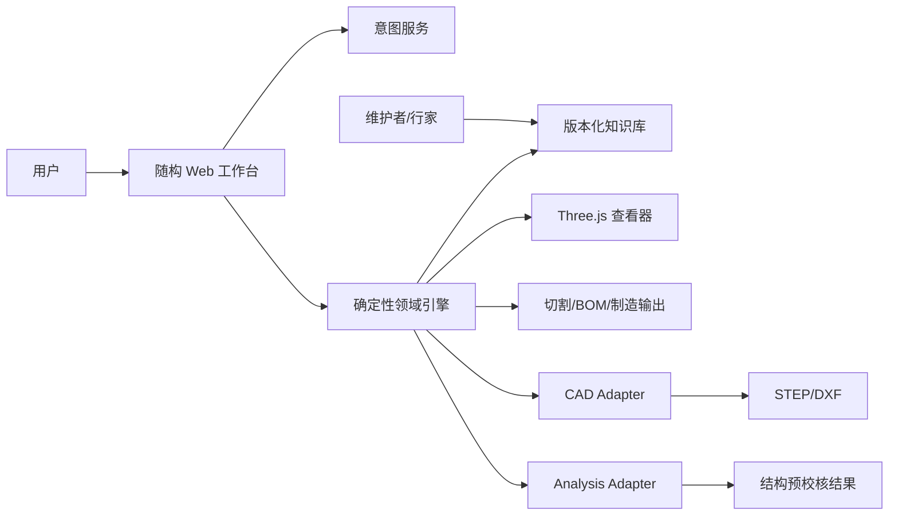
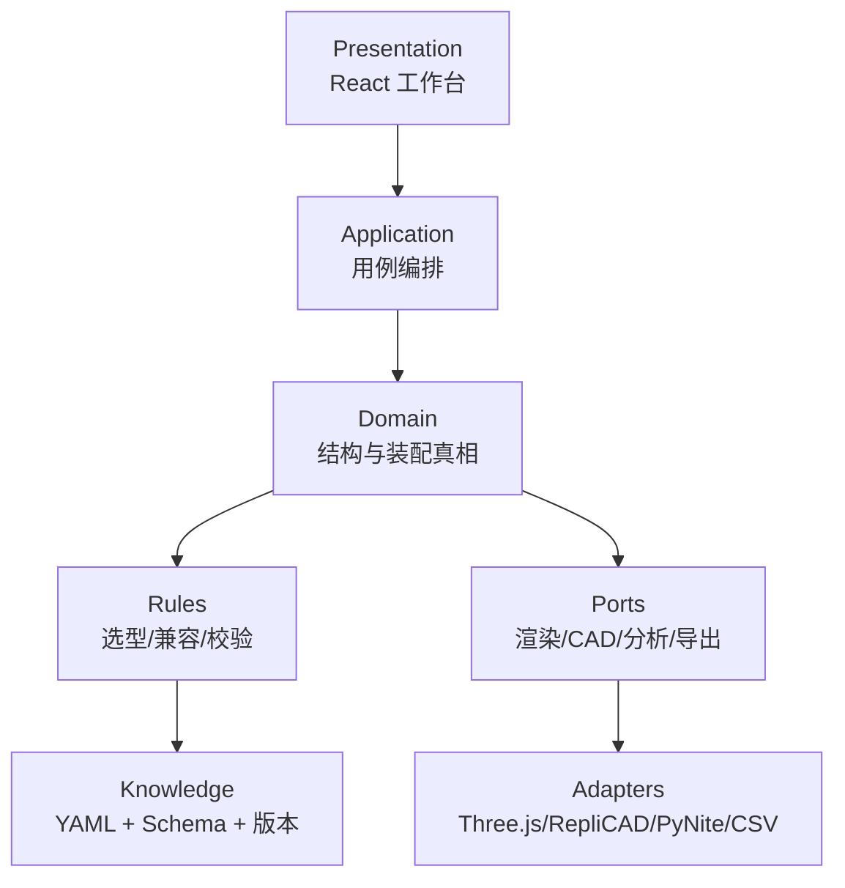
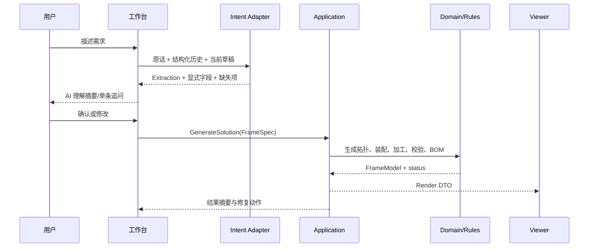
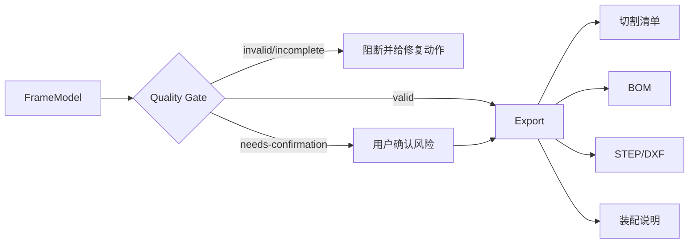

---
tags:
  - 随构
  - 项目架构
  - 技术设计
  - ADR
created: 2026-08-05
status: 生效中
baseline: 91d6382
---

# 随构 · 项目架构设计

> [!info] 文档定位
> 本文定义随构从 Phase 0 到 Phase 1 的目标架构、模块边界、核心数据模型和演进规则。它回答“系统应该如何分层、谁拥有事实、开源引擎放在哪里”，不替代具体功能需求。执行计划见 [[18-项目实施计划]]，问题来源见 [[16-产品体验与结构能力评测]]。

## 一、架构目标

随构的目标不是做一个通用 CAD，而是把用户需求转换为一套**能解释、能校验、能采购、能装配、能导出**的铝型材结构方案。

架构必须保证：

1. **LLM 不计算几何**：只负责抽取、澄清和解释。
2. **领域模型是唯一事实源**：3D、BOM、图纸、校验和导出必须来自同一模型。
3. **画出来等于能追溯**：每个可见零件都有来源、装配关系和 BOM 映射。
4. **错误不能进入制造输出**：兼容、完整性和结构风险通过质量闸门控制。
5. **知识库驱动扩展**：增加型材、连接件和规则时，尽量不修改生成器分支。
6. **开源引擎可替换**：Three.js、RepliCAD、PyNite 等都是适配器，不拥有业务真相。
7. **安全结论可解释**：计算输入、规则、假设、未验证项和版本全部可追溯。
8. **先支持受控方案空间**：正交框架优先，不提前演变成自由建模器。

## 二、范围与边界

### 2.1 Phase 0 支持

- 矩形正交框架。
- 顶框、底框、水平隔板层。
- 顶板、隔板及真实固定关系。
- 固定脚、脚轮附件。
- 型材、连接件、加工特征、切割清单和 BOM。
- 规则级选型、竖向挠度、柱屈曲和侧向稳定性提示。
- 一句话需求、多轮澄清、手动参数微调。

### 2.2 近期扩展

- 单斜撑、X 斜撑、三角加强件。
- 左/右侧板、背板，并区分围护板与结构剪力板。
- 2040、3060、4080 等矩形主梁和配套连接件。
- RepliCAD 精确几何/STEP PoC。
- PyNite 梁框架预校核 PoC。

### 2.3 明确不做

- 自由拖拽 CAD、任意曲面和复杂异形。
- 自动承诺工程认证或替代持证工程师。
- Phase 0 的登录、支付、订单、移动端。
- 未经验证的局部连接应力、螺栓预紧和接触非线性结论。

## 三、系统上下文



用户只与“需求、参数、方案、风险、输出”交互。LLM、CAD 内核、有限元库和知识库版本属于系统内部实现，不应直接暴露为普通用户概念。

## 四、分层架构



### 4.1 Presentation 层

职责：

- 需求输入、AI 理解确认和追问。
- 参数编辑、锁定字段和改动影响提示。
- 外观/结构/图纸视图。
- 方案状态、风险、清单和导出入口。
- 不包含几何公式、选型阈值或 BOM 计算。

当前入口为 `src/App.tsx`，后续应拆分为工作台容器和独立面板，避免所有状态与业务逻辑集中在单文件。

### 4.2 Application 层

负责组织用例，不实现工程算法：

- `CreateDraftFromIntent`
- `ApplyManualPatch`
- `GenerateSolution`
- `ValidateSolution`
- `AcceptRecommendation`
- `ExportManufacturingPackage`
- `CompareSolutions`（Phase 1）

每个用例输入和输出应为明确 DTO，禁止直接依赖 React 状态。

### 4.3 Domain 层

系统核心。负责：

- 结构拓扑、构件、面板、附件。
- 接头、安装关系、紧固件和加工特征。
- 坐标系、局部加工面和件号身份。
- 载荷工况、受力路径和方案完整性。
- 与任何渲染/CAD/FEA 库无关。

### 4.4 Rules 层

负责：

- 型材与连接件兼容性。
- 截面和连接方式推荐。
- 板材安装与间隙规则。
- 斜撑/侧向稳定性触发。
- 质量状态和导出闸门。
- 将规则结果输出为结构化 `CheckResult`，而非散落的提示字符串。

### 4.5 Infrastructure / Adapters 层

- `ThreeRenderAdapter`：交互显示。
- `CsvExportAdapter`：切割与 BOM。
- `ReplicadAdapter`：精确 B-Rep 与 STEP PoC。
- `CadServiceAdapter`：build123d/CadQuery 后端。
- `PyNiteAdapter`：梁框架预校核。
- `LongCatIntentAdapter`：LLM 抽取。
- `LocalProjectStore` / `ProjectApiStore`：方案持久化。

## 五、核心领域模型

### 5.1 输入模型

```text
ProjectDraft
├─ rawRequirement
├─ extraction
├─ explicitlyMentionedFields
├─ assumptions
├─ unansweredQuestions
├─ unsupportedRequirements
├─ lockedFields
└─ frameSpec
```

`FrameSpec` 表达用户要什么，不应混入渲染对象。建议逐步补充：

- 基础尺寸、层数、载荷和场景。
- 板材面位、安装模式、外伸量。
- 侧板/背板语义。
- 抗侧移体系。
- 振动、锚固和移动工况。
- 成本/外观偏好。

### 5.2 方案模型

```text
FrameModel
├─ specSnapshot
├─ designCase
├─ members[]
├─ panels[]
├─ accessories[]
├─ joints[]
├─ mounts[]
├─ fasteners[]
├─ machining[]
├─ loadPaths[]
├─ checks[]
├─ bom[]
├─ cutList[]
├─ totals
├─ status
└─ provenance
```

### 5.3 实体职责

| 实体 | 职责 | 不应承担 |
|---|---|---|
| `MemberItem` | 型材梁柱、斜撑、长度、方向、截面 | UI 颜色 |
| `PanelItem` | 顶板、隔板、侧板、背板的几何和材料 | 用字符串假装固定 |
| `AccessoryItem` | 脚轮、地脚、端盖等附件 | 混入主型材计数 |
| `Joint` | 型材与型材连接 | 板材安装 |
| `Mount` | 面板/附件固定到主体 | 结构接头选型 |
| `FastenerItem` | 螺栓、螺母、胶条、压条、垫片 | 只存在于备注 |
| `MachiningFeature` | 孔、攻丝、沉头、切角和局部坐标 | 使用世界坐标作为身份 |
| `LoadPath` | 荷载从板材到梁柱和支座的路径 | 替代完整 FEA |
| `CheckResult` | 规则、等级、对象、证据、修复动作 | 仅保存人读文本 |
| `BOMItem` | SKU、规格、数量、价格、来源 | 重新猜测装配关系 |

### 5.4 身份与可追溯

每个派生对象必须保留：

- `id`：方案内稳定标识。
- `sourceRuleId`：由哪条规则生成。
- `sourceEntityIds`：由哪些构件/接头派生。
- `knowledgeVersion`：使用的知识库版本。
- `confidence`：verified/public/inferred/pending。

件号签名基于截面、长度和局部加工特征，包含孔位、加工面、方向和端部；镜像件只有制造完全等价时才能共用件号。

## 六、关键数据流

### 6.1 从需求到方案



### 6.2 从方案到制造输出



导出函数本身必须执行质量闸门，不能只依赖按钮禁用。

## 七、DesignCase：统一计算口径

当前选型、推荐和校验容易各自计算载荷。建议引入一次性派生对象：

```text
DesignCase
├─ serviceLoad
├─ safetyFactor
├─ impactFactor
├─ designLoad
├─ loadType
├─ sceneLimit
├─ vibration
├─ mobility
├─ supportCondition
└─ assumptions[]
```

截面选型、连接推荐、挠度、屈曲、斜撑规则、解释文本和 PyNite 输入必须共享同一个 `DesignCase`，避免“校验按 75kg、推荐仍按 30kg”的漂移。

## 八、知识库架构

### 8.1 数据分类

```text
knowledge/
├─ sections/       型材截面与力学参数
├─ connectors/     连接件能力、兼容、加工、BOM
├─ accessories/    脚轮、地脚、端盖
├─ panels/         板材、面密度、厚度和安装模式
├─ fasteners/      紧固件与价格
├─ rules/          选型、校验、工艺、材料接口
├─ suppliers/      供应商 SKU 与替代关系（Phase 1）
└─ tests/          Golden 与知识库契约用例
```

### 8.2 数据原则

- YAML 负责数据，TypeScript Schema 负责结构验证。
- 加载失败、字段缺失、重复 ID 和悬空引用必须在启动或 CI 阶段失败。
- `select.ts` 与 `validate.ts` 不再各自硬编码跨度表。
- 兼容关系至少覆盖系列、槽宽、芯孔、紧固件和安装面。
- 每条数据必须有来源、置信度、审核状态和版本。

## 九、状态与质量闸门

| 状态 | 含义 | 导出策略 |
|---|---|---|
| `valid` | 已执行范围内无错误和未完成项 | 允许 |
| `needs-confirmation` | 有可接受警告，用户需确认 | 确认后允许 |
| `invalid` | 兼容、结构或规则错误 | 禁止 |
| `incomplete` | 缺装配关系、SKU、参数或未满足强制结构条件 | 禁止完整制造包 |

状态由结构化规则聚合产生。用户必须能看到：

- 已验证项目。
- 未验证项目。
- 阻断原因。
- 一键修复或替代方案。

## 十、前端目标结构

```text
src/
├─ app/
│  ├─ AppShell.tsx
│  ├─ use-cases/
│  └─ state/
├─ features/
│  ├─ intent/
│  ├─ parameters/
│  ├─ solution-summary/
│  ├─ validation/
│  ├─ manufacturing/
│  └─ viewer/
├─ domain/
│  ├─ model/
│  ├─ generation/
│  ├─ rules/
│  └─ services/
├─ adapters/
│  ├─ longcat/
│  ├─ three/
│  ├─ csv/
│  ├─ replicad/
│  └─ analysis/
├─ knowledge/
└─ shared/
```

这是目标结构，不要求一次性重构。采用“修改到哪里拆到哪里”的渐进方式，禁止为了目录美观进行大搬家。

## 十一、外部引擎边界

### 11.1 Three.js

只消费 `RenderModel`，负责网格、材质、拾取、尺寸标注和视角；不得计算下料长度、装配关系或 BOM。

### 11.2 RepliCAD / OCCT

消费领域模型并生成精确实体、孔和 STEP。CAD 失败不能破坏 Three.js 与 BOM 主链。建议放入 Web Worker，并固定版本与许可证资产。

### 11.3 PyNite

消费 `AnalysisModel`：节点、梁单元、材料、截面、释放、支座、荷载组合。返回位移、内力、支反力和假设；不直接修改领域方案。

### 11.4 LLM

输入结构化对话历史、当前草稿和锁定字段；输出 Extraction/JSON Patch。禁止直接输出构件坐标、孔位、BOM 数量或安全结论。

## 十二、持久化与版本

Phase 0 可使用本地存储，Phase 1 迁移后端。建议保存：

```text
Project
├─ projectId / revision
├─ rawConversation
├─ draft
├─ generatedModelSnapshot
├─ knowledgeVersion
├─ engineVersion
├─ exportedArtifacts
└─ decisions / confirmations
```

同一项目每次生成形成 revision，不覆盖历史。导出文件必须带方案版本和知识库版本。

## 十三、测试架构

### 13.1 测试金字塔

- **知识库契约测试**：Schema、引用、兼容矩阵和来源字段。
- **领域单元测试**：几何、装配、件号、BOM、状态机。
- **规则参数化测试**：阈值、边界和风险组合。
- **适配器契约测试**：Three Render DTO、CSV、STEP、PyNite 输入。
- **Golden 场景测试**：真实一句话需求到完整方案。
- **浏览器 E2E**：生成、微调、风险修复、导出。
- **视觉/像素测试**：3D 非空、板材接触、脚轮/固定点可见。

### 13.2 强制不变量

- 每个可见实体都能追溯到 BOM 或明确标记非采购展示对象。
- 每块板和每个附件至少有一个有效 Mount。
- 每个 Mount 的紧固件都存在于 BOM。
- 每个 Joint 的连接件与两侧构件兼容。
- `invalid/incomplete` 永远不能导出完整制造包。
- 3D、切割、BOM 和 STEP 的零件数量一致。

## 十四、安全、隐私与许可

- API Key 生产环境不得由浏览器长期直接持有，Phase 1 通过后端代理。
- 日志不记录 Key、完整敏感需求或未脱敏模型响应。
- 高风险场景必须明确假设、未验证项和责任边界。
- 第三方依赖建立 SBOM 与许可证清单。
- 使用 OCCT/RepliCAD 时保留 LGPL/exception 通知、对应源码获取方式和版本。

## 十五、部署演进

### Phase 0

```text
Browser
├─ React / Three.js
├─ Domain + Rules
├─ YAML Knowledge
└─ LongCat via Vite dev proxy
```

### Phase 1

```text
Browser
├─ React / Three.js
└─ API Client

Backend
├─ Project API
├─ Intent Proxy
├─ Domain Worker
├─ CAD Worker
├─ Analysis Worker
└─ Artifact Storage
```

优先采用模块化单体和异步 Worker，不提前拆微服务。只有 CAD/分析任务因运行环境、资源和许可证需要才隔离进程。

## 十六、架构决策记录

| ADR | 决策 | 状态 |
|---|---|---|
| ADR-001 | LLM 只抽参数，不计算几何 | 已采纳 |
| ADR-002 | 领域模型是唯一事实源 | 已采纳 |
| ADR-003 | Three.js 保留为交互查看器 | 已采纳 |
| ADR-004 | 兼容与质量状态阻断制造导出 | 已采纳 |
| ADR-005 | 装配层使用 Joint/Mount/Fastener/Accessory | 已采纳 |
| ADR-006 | 选型与校验共享 DesignCase | 待实施 |
| ADR-007 | RepliCAD 仅以 Adapter PoC 接入 | 待验证 |
| ADR-008 | PyNite 作为后端预校核候选 | 待验证 |
| ADR-009 | Phase 1 采用模块化单体，不提前微服务化 | 已采纳 |

## 十七、架构完成判据

当以下条件成立，架构才算从 Demo 进入可持续产品基础：

- [ ] UI、应用用例、领域逻辑和适配器边界可独立测试。
- [ ] 增加一种兼容型材/连接件无需修改多个硬编码分支。
- [ ] 所有板材、脚轮、斜撑和侧板拥有真实装配关系与 BOM。
- [ ] DesignCase 统一驱动推荐和校验。
- [ ] 真实需求 Golden 集覆盖生成、装配、校验、BOM 和导出。
- [ ] CAD/分析适配器失败时主链可降级。
- [ ] 每个制造输出都能追溯到方案、知识库和引擎版本。

> [!note] 判据进展（2026-08-06 对照，基线 91d6382）
> - ✅ 所有板材、脚轮、斜撑、侧板、门、LED 拥有真实装配关系与 BOM（Mount/Fastener 全覆盖，CLI 强制不变量守护）
> - ✅ 真实需求 Golden 集覆盖生成、装配、校验、BOM（`npm run golden` 7 用例 + `npm run m5` 10 条原生需求）
> - 🔶 增加兼容型材/连接件大部分免改分支（知识库驱动 + intent 兼容回退），但 select.ts 跨度表仍硬编码（迁移挂 M5.1 遗留）
> - ⬜ Application 层用例编排、DesignCase（ADR-006）、CAD/分析适配器、制造输出版本追溯——Phase 1 架构对齐时实施
> - 现状详评：见 2026-08-06 会话"架构符合性核查"（核心原则八条+已采纳 ADR 全部符合，App.tsx 拆分按"改到哪里拆到哪里"执行）
